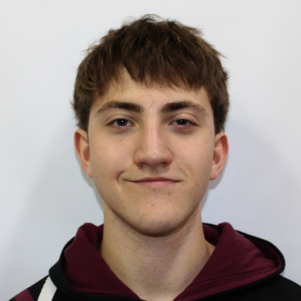

<h1 align="center">📌 Programación II – Repositorio Personal</h1>

<h2>📖 Descripción</h2>

Repositorio personal de la materia <b>Programación II</b>, orientado al aprendizaje de 
<b>Java</b>, <b>Programación Orientada a Objetos</b> y <b>Tipos de Datos Abstractos (TDA)</b>.
Aquí se documentan y desarrollan las actividades y ejercicios individuales realizados durante la cursada.

<b>Disclaimer:</b> El trabajo práctico grupal de la materia se encuentra en un repositorio separado.

<h2>👤 Autor</h2>

  <b>Juan Rocca</b>  
  
  Estudiante de Ingeniería Informática

<h2>⚙️ Tecnologías utilizadas</h2>
<ul>
  <li>Java</li>
  <li>Git / GitHub</li>
</ul>

<h2>🛠️ Actividades</h2>

En esta sección se irán agregando las actividades, ejercicios y resoluciones realizadas durante la materia.

